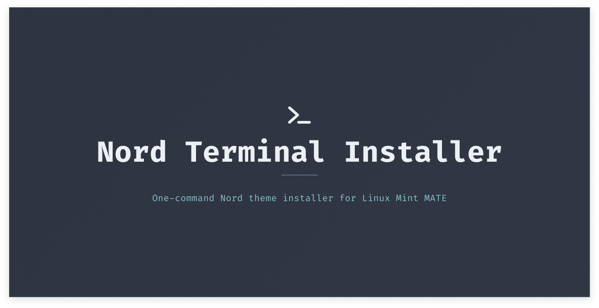

# Nord Terminal Installer



[](https://opensource.org/licenses/MIT)
[](https://www.python.org/)
[](https://linuxmint.com/)

---

## Description

**Nord Terminal Installer** is a Python script that automatically applies the [Nord color palette](https://www.nordtheme.com/) to your 'mate-terminal' on Linux Mint MATE. It creates a dedicated profile, preserves your font and cursor preferences, and includes a safe rollback mechanism.

### Why Nord?

Nord is a carefully designed, eye-comfortable palette with dimmed pastel colors, optimized for long coding sessions and low-light environments.

---

## Features

- **One-command installation** - no manual configuration
- **Safe backups** - your original settings are always preserved
- **Easy rollback** - revert to your previous configuration with `--revert`
- **Dry-run mode** - preview changes before applying them (`--dry-run`)
- **Preserves your font, cursor, and scroll preferences** - only colors change
- **Automatic terminal restart** - changes apply immediately

---

## Installation

### Prerequisites

- Linux Mint with **MATE** desktop
- Python 3.6+
- `dconf` and `gsettings` (preinstalled on MATE)

### Quick start

Clone the repository and run the installer:

```bash
git clone https://github.com/ThomasStark13/nord-terminal-installer
cd nord-terminal-installer
python3 src/nord_terminal_setup.py
```

## Usage

### Install Nord (default)

```bash
python3 src/nord_terminal_setup.py
```

### Preview changes (dry-run)

```bash
python3 src/nord_terminal_setup.py --dry-run
```

### Revert to original configuration

```bash
python3 src/nord_terminal_setup.py --revert
```

## Screenshots

| Before                                       | After                                      |
| -------------------------------------------- | ------------------------------------------ |
|  |  |

## How it works

1. **Backup**: Dumps your current `default` profile to `~/nord-backup/default_profile.conf`
2. **Create profile**: Writes Nord colors to a new `nord` profile using `dconf`
3. **Activate**: Adds `nord` to the profile list and sets it as default.
4. **Restart**: Kills `mate-terminal` to apply changes

The `--revert` option restores the backup and removes `nord` from the profile list.

## Project structure

```text
nord-terminal-installer/
├── src/
│   └── nord_terminal_setup.py   # Main script
├── screenshots/                  # Screenshots for README
├── README.md                     # This file
├── LICENSE                       # MIT License
└── .gitignore                    # Ignored files
```

## Contributing

Contributions are welcome! Feel free to:

- Open an issue for bugs or feature requests
- Submit a pull request with improvements
- Share this project with others

Please follow the [Conventional Commits](https://www.conventionalcommits.org/) specification for commit messages.

## License

This project is licensed under the MIT License. See the [License](/LICENSE) file for more details.

## Acknowledgements

- [Nord Theme](https://www.nordtheme.com/) - for the beautiful color palette
- [Linux Mint](https://linuxmint.com/) - for the great MATE desktop

## Contact

- Author: [Thomas Stark](https://github.com/ThomasStark13)
- Project Link: [Repository](https://github.com/ThomasStark13/nord-terminal-installer)

_Made with ❤️ for the Linux community._
